# DANDI Notebook Generation Results

## Summary

| Notebook | Folder | Model | Generated At | Generation Time (s) | Images | Tokens | Est $ |
|----------|---------|-------|--------------|---------------------|--------| ------ | ----- |
| [000673.ipynb](https://github.com/dandi-ai-notebooks/000673/blob/main/2025-04-07-claude-3.5-sonnet/000673.ipynb) | 2025-04-07-claude-3.5-sonnet | anthropic/claude-3.5-sonnet () | 2025-04-07 14:36:01 | 215.81 | 3 | 287.6k + 3.306k / 6.2k + 0.417k | 0.96 + 0.02 |
| [000673.ipynb](https://github.com/dandi-ai-notebooks/000673/blob/main/2025-04-09-claude-3.7-sonnet/000673.ipynb) | 2025-04-09-claude-3.7-sonnet | anthropic/claude-3.7-sonnet () | 2025-04-09 23:30:48 | 929.34 | 13 | 2274.4k + 14.411k / 31.2k + 1.635k | 7.29 + 0.07 |
| [000673.ipynb](https://github.com/dandi-ai-notebooks/000673/blob/main/2025-04-02-claude-3.7-sonnet/000673.ipynb) | 2025-04-02-claude-3.7-sonnet | anthropic/claude-3.7-sonnet () | 2025-04-02 16:34:35 | 650.13 | 9 | 1053.1k + 10.814k / 20.2k + 1.795k | 3.46 + 0.06 |
| [000673.ipynb](https://github.com/dandi-ai-notebooks/000673/blob/main/2025-04-04-deepseek-chat-v3-0324/000673.ipynb) | 2025-04-04-deepseek-chat-v3-0324 | deepseek/deepseek-chat-v3-0324 () | 2025-04-04 13:20:49 | 669.76 | 3 | 243.1k + 0.187k / 5.1k + 0.33k | 0.07 + 0.00 |
| [000673.ipynb](https://github.com/dandi-ai-notebooks/000673/blob/main/2025-04-04-gemini-2.0-flash-001/000673.ipynb) | 2025-04-04-gemini-2.0-flash-001 | google/gemini-2.0-flash-001 () | 2025-04-04 12:26:01 | 57.59 | 3 | 208.3k + 6.712k / 4.5k + 0.299k | 0.02 + 0.00 |
| [000673.ipynb](https://github.com/dandi-ai-notebooks/000673/blob/main/2025-04-07-quasar-alpha-exp/000673.ipynb) | 2025-04-07-quasar-alpha-exp | openrouter/quasar-alpha () | 2025-04-07 13:06:02 | 234.77 | 3 | 230.6k + 1.599k / 5.5k + 0.29k | nan + nan |
| [000673.ipynb](https://github.com/dandi-ai-notebooks/000673/blob/main/2025-04-09-quasar-alpha/000673.ipynb) | 2025-04-09-quasar-alpha | openrouter/quasar-alpha () | 2025-04-09 21:09:50 | 319.95 | 4 | 710.5k + 3.194k / 6.3k + 0.443k | nan + nan |
| [000945.ipynb](https://github.com/dandi-ai-notebooks/000945/blob/main/2025-04-07-claude-3.5-sonnet/000945.ipynb) | 2025-04-07-claude-3.5-sonnet | anthropic/claude-3.5-sonnet () | 2025-04-07 14:50:38 | 256.28 | 3 | 264.4k + 3.411k / 6.1k + 0.599k | 0.88 + 0.02 |
| [000945.ipynb](https://github.com/dandi-ai-notebooks/000945/blob/main/2025-04-02-claude-3.7-sonnet/000945.ipynb) | 2025-04-02-claude-3.7-sonnet | anthropic/claude-3.7-sonnet () | 2025-04-02 17:00:27 | 740.43 | 11 | 738.7k + 9.765k / 23.1k + 2.224k | 2.56 + 0.06 |
| [000945.ipynb](https://github.com/dandi-ai-notebooks/000945/blob/main/2025-04-01-deepseek-chat-v3-0324/000945.ipynb) | 2025-04-01-deepseek-chat-v3-0324 | deepseek/deepseek-chat-v3-0324 () | 2025-04-01 09:03:57 | 1090.70 | 4 | 485.2k + 0.0k / 11.4k + 0.0k | 0.14 + 0.00 |
| [000945.ipynb](https://github.com/dandi-ai-notebooks/000945/blob/main/2025-04-04-gemini-2.0-flash-001/000945.ipynb) | 2025-04-04-gemini-2.0-flash-001 | google/gemini-2.0-flash-001 () | 2025-04-04 12:33:24 | 64.18 | 2 | 279.9k + 4.297k / 5.3k + 0.137k | 0.03 + 0.00 |
| [000945.ipynb](https://github.com/dandi-ai-notebooks/000945/blob/main/2025-04-07-quasar-alpha-exp/000945.ipynb) | 2025-04-07-quasar-alpha-exp | openrouter/quasar-alpha () | 2025-04-07 13:13:16 | 252.12 | 3 | 211.3k + 2.574k / 5.5k + 0.31k | nan + nan |
| [000945.ipynb](https://github.com/dandi-ai-notebooks/000945/blob/main/2025-04-09-quasar-alpha/000945.ipynb) | 2025-04-09-quasar-alpha | openrouter/quasar-alpha () | 2025-04-09 21:13:47 | 234.38 | 2 | 273.2k + 2.076k / 5.5k + 0.227k | nan + nan |
| [001174.ipynb](https://github.com/dandi-ai-notebooks/001174/blob/main/2025-04-07-claude-3.5-sonnet/001174.ipynb) | 2025-04-07-claude-3.5-sonnet | anthropic/claude-3.5-sonnet () | 2025-04-07 14:57:48 | 196.64 | 4 | 235.3k + 2.722k / 5.8k + 0.44k | 0.79 + 0.01 |
| [001174.ipynb](https://github.com/dandi-ai-notebooks/001174/blob/main/2025-04-03-claude-3.7-sonnet/001174.ipynb) | 2025-04-03-claude-3.7-sonnet | anthropic/claude-3.7-sonnet () | 2025-04-03 14:29:14 | 475.38 | 9 | 783.5k + 14.305k / 16.8k + 1.935k | 2.60 + 0.07 |
| [001174.ipynb](https://github.com/dandi-ai-notebooks/001174/blob/main/2025-04-01-deepseek-chat-v3-0324/001174.ipynb) | 2025-04-01-deepseek-chat-v3-0324 | deepseek/deepseek-chat-v3-0324 () | 2025-04-01 07:50:06 | 465.49 | 3 | 182.9k + 0.0k / 4.0k + 0.0k | 0.05 + 0.00 |
| [001174.ipynb](https://github.com/dandi-ai-notebooks/001174/blob/main/2025-04-04-gemini-2.0-flash-001/001174.ipynb) | 2025-04-04-gemini-2.0-flash-001 | google/gemini-2.0-flash-001 () | 2025-04-04 12:41:41 | 54.46 | 2 | 202.9k + 3.219k / 4.0k + 0.183k | 0.02 + 0.00 |
| [001174.ipynb](https://github.com/dandi-ai-notebooks/001174/blob/main/2025-04-07-quasar-alpha-exp/001174.ipynb) | 2025-04-07-quasar-alpha-exp | openrouter/quasar-alpha () | 2025-04-07 13:20:24 | 249.35 | 3 | 198.6k + 1.181k / 5.1k + 0.248k | nan + nan |
| [001174.ipynb](https://github.com/dandi-ai-notebooks/001174/blob/main/2025-04-09-quasar-alpha/001174.ipynb) | 2025-04-09-quasar-alpha | openrouter/quasar-alpha () | 2025-04-09 21:16:30 | 159.18 | 0 | 220.4k + 2.104k / 4.5k + 0.192k | nan + nan |
| [001176.ipynb](https://github.com/dandi-ai-notebooks/001176/blob/main/2025-04-07-claude-3.5-sonnet/001176.ipynb) | 2025-04-07-claude-3.5-sonnet | anthropic/claude-3.5-sonnet () | 2025-04-07 15:12:07 | 176.68 | 2 | 204.7k + 2.101k / 4.5k + 0.37k | 0.68 + 0.01 |
| [001176.ipynb](https://github.com/dandi-ai-notebooks/001176/blob/main/2025-04-02-claude-3.7-sonnet/001176.ipynb) | 2025-04-02-claude-3.7-sonnet | anthropic/claude-3.7-sonnet () | 2025-04-02 17:40:27 | 770.31 | 8 | 1166.3k + 9.979k / 23.6k + 1.345k | 3.85 + 0.05 |
| [001176.ipynb](https://github.com/dandi-ai-notebooks/001176/blob/main/2025-04-04-gemini-2.0-flash-001/001176.ipynb) | 2025-04-04-gemini-2.0-flash-001 | google/gemini-2.0-flash-001 () | 2025-04-04 12:45:14 | 75.16 | 3 | 267.9k + 5.593k / 4.5k + 0.203k | 0.03 + 0.00 |
| [001176.ipynb](https://github.com/dandi-ai-notebooks/001176/blob/main/2025-04-07-quasar-alpha-exp/001176.ipynb) | 2025-04-07-quasar-alpha-exp | openrouter/quasar-alpha () | 2025-04-07 13:30:55 | 264.52 | 4 | 294.6k + 2.232k / 5.7k + 0.405k | nan + nan |
| [001176.ipynb](https://github.com/dandi-ai-notebooks/001176/blob/main/2025-04-09-quasar-alpha/001176.ipynb) | 2025-04-09-quasar-alpha | openrouter/quasar-alpha () | 2025-04-09 21:23:29 | 293.12 | 4 | 353.4k + 2.832k / 5.9k + 0.621k | nan + nan |
| [001275.ipynb](https://github.com/dandi-ai-notebooks/001275/blob/main/2025-04-07-claude-3.5-sonnet/001275.ipynb) | 2025-04-07-claude-3.5-sonnet | anthropic/claude-3.5-sonnet () | 2025-04-07 15:07:05 | 274.05 | 7 | 440.7k + 7.165k / 6.4k + 0.849k | 1.42 + 0.03 |
| [001275.ipynb](https://github.com/dandi-ai-notebooks/001275/blob/main/2025-04-02-claude-3.7-sonnet/001275.ipynb) | 2025-04-02-claude-3.7-sonnet | anthropic/claude-3.7-sonnet () | 2025-04-02 19:31:07 | 1976.51 | 11 | 1003.1k + 10.921k / 22.1k + 2.157k | 3.34 + 0.07 |
| [001275.ipynb](https://github.com/dandi-ai-notebooks/001275/blob/main/2025-04-04-deepseek-chat-v3-0324/001275.ipynb) | 2025-04-04-deepseek-chat-v3-0324 | deepseek/deepseek-chat-v3-0324 () | 2025-04-04 14:56:59 | 420.59 | 3 | 189.0k + 0.134k / 3.8k + 0.338k | 0.06 + 0.00 |
| [001275.ipynb](https://github.com/dandi-ai-notebooks/001275/blob/main/2025-04-04-gemini-2.0-flash-001/001275.ipynb) | 2025-04-04-gemini-2.0-flash-001 | google/gemini-2.0-flash-001 () | 2025-04-04 12:43:52 | 42.87 | 1 | 151.9k + 1.863k / 3.7k + 0.074k | 0.02 + 0.00 |
| [001275.ipynb](https://github.com/dandi-ai-notebooks/001275/blob/main/2025-04-07-quasar-alpha-exp/001275.ipynb) | 2025-04-07-quasar-alpha-exp | openrouter/quasar-alpha () | 2025-04-07 13:26:28 | 193.64 | 5 | 200.0k + 2.637k / 5.5k + 0.489k | nan + nan |
| [001275.ipynb](https://github.com/dandi-ai-notebooks/001275/blob/main/2025-04-09-quasar-alpha/001275.ipynb) | 2025-04-09-quasar-alpha | openrouter/quasar-alpha () | 2025-04-09 21:18:32 | 120.12 | 2 | 153.8k + 1.069k / 4.1k + 0.276k | nan + nan |
| [001276.ipynb](https://github.com/dandi-ai-notebooks/001276/blob/main/2025-04-07-claude-3.5-sonnet/001276.ipynb) | 2025-04-07-claude-3.5-sonnet | anthropic/claude-3.5-sonnet () | 2025-04-07 14:42:12 | 367.91 | 1 | 355.0k + 4.71k / 6.3k + 0.446k | 1.16 + 0.02 |
| [001276.ipynb](https://github.com/dandi-ai-notebooks/001276/blob/main/2025-04-09-claude-3.7-sonnet/001276.ipynb) | 2025-04-09-claude-3.7-sonnet | anthropic/claude-3.7-sonnet () | 2025-04-09 23:40:40 | 588.37 | 10 | 1044.2k + 9.172k / 22.3k + 1.452k | 3.47 + 0.05 |
| [001276.ipynb](https://github.com/dandi-ai-notebooks/001276/blob/main/2025-04-02-claude-3.7-sonnet/001276.ipynb) | 2025-04-02-claude-3.7-sonnet | anthropic/claude-3.7-sonnet () | 2025-04-02 20:26:59 | 2024.90 | 0 | 2625.4k + 6.834k / 42.4k + 1.059k | 8.51 + 0.04 |
| [001276.ipynb](https://github.com/dandi-ai-notebooks/001276/blob/main/2025-04-04-deepseek-chat-v3-0324/001276.ipynb) | 2025-04-04-deepseek-chat-v3-0324 | deepseek/deepseek-chat-v3-0324 () | 2025-04-04 14:14:18 | 435.83 | 1 | 336.4k + 0.098k / 4.9k + 0.303k | 0.10 + 0.00 |
| [001276.ipynb](https://github.com/dandi-ai-notebooks/001276/blob/main/2025-04-04-gemini-2.0-flash-001/001276.ipynb) | 2025-04-04-gemini-2.0-flash-001 | google/gemini-2.0-flash-001 () | 2025-04-04 12:31:32 | 138.77 | 1 | 229.4k + 1.359k / 3.8k + 0.063k | 0.02 + 0.00 |
| [001276.ipynb](https://github.com/dandi-ai-notebooks/001276/blob/main/2025-04-07-quasar-alpha-exp/001276.ipynb) | 2025-04-07-quasar-alpha-exp | openrouter/quasar-alpha () | 2025-04-07 13:09:01 | 176.87 | 1 | 185.1k + 0.871k / 4.5k + 0.102k | nan + nan |
| [001276.ipynb](https://github.com/dandi-ai-notebooks/001276/blob/main/2025-04-09-quasar-alpha/001276.ipynb) | 2025-04-09-quasar-alpha | openrouter/quasar-alpha () | 2025-04-09 21:32:21 | 200.46 | 1 | 132.2k + 0.348k / 3.9k + 0.073k | nan + nan |
| [001333.ipynb](https://github.com/dandi-ai-notebooks/001333/blob/main/2025-04-07-claude-3.5-sonnet/001333.ipynb) | 2025-04-07-claude-3.5-sonnet | anthropic/claude-3.5-sonnet () | 2025-04-07 14:54:28 | 226.82 | 5 | 296.5k + 3.119k / 6.9k + 0.651k | 0.99 + 0.02 |
| [001333.ipynb](https://github.com/dandi-ai-notebooks/001333/blob/main/2025-04-02-claude-3.7-sonnet/001333.ipynb) | 2025-04-02-claude-3.7-sonnet | anthropic/claude-3.7-sonnet () | 2025-04-02 20:43:44 | 646.79 | 7 | 1043.4k + 7.406k / 17.6k + 1.856k | 3.39 + 0.05 |
| [001333.ipynb](https://github.com/dandi-ai-notebooks/001333/blob/main/2025-04-04-deepseek-chat-v3-0324/001333.ipynb) | 2025-04-04-deepseek-chat-v3-0324 | deepseek/deepseek-chat-v3-0324 () | 2025-04-04 14:34:28 | 140.00 | 1 | 163.5k + 0.0k / 2.0k + 0.0k | 0.05 + 0.00 |
| [001333.ipynb](https://github.com/dandi-ai-notebooks/001333/blob/main/2025-04-04-gemini-2.0-flash-001/001333.ipynb) | 2025-04-04-gemini-2.0-flash-001 | google/gemini-2.0-flash-001 () | 2025-04-04 12:36:12 | 117.28 | 1 | 800.6k + 2.412k / 12.7k + 0.066k | 0.09 + 0.00 |
| [001333.ipynb](https://github.com/dandi-ai-notebooks/001333/blob/main/2025-04-07-quasar-alpha-exp/001333.ipynb) | 2025-04-07-quasar-alpha-exp | openrouter/quasar-alpha () | 2025-04-07 13:16:12 | 172.43 | 1 | 203.2k + 1.206k / 4.8k + 0.094k | nan + nan |
| [001333.ipynb](https://github.com/dandi-ai-notebooks/001333/blob/main/2025-04-09-quasar-alpha/001333.ipynb) | 2025-04-09-quasar-alpha | openrouter/quasar-alpha () | 2025-04-09 21:36:07 | 101.92 | 1 | 125.9k + 0.71k / 3.6k + 0.074k | nan + nan |
| [001335.ipynb](https://github.com/dandi-ai-notebooks/001335/blob/main/2025-04-07-claude-3.5-sonnet/001335.ipynb) | 2025-04-07-claude-3.5-sonnet | anthropic/claude-3.5-sonnet () | 2025-04-07 14:46:19 | 244.23 | 4 | 301.0k + 3.996k / 7.1k + 0.626k | 1.01 + 0.02 |
| [001335.ipynb](https://github.com/dandi-ai-notebooks/001335/blob/main/2025-04-09-claude-3.7-sonnet/001335.ipynb) | 2025-04-09-claude-3.7-sonnet | anthropic/claude-3.7-sonnet () | 2025-04-09 23:51:58 | 673.37 | 14 | 1164.2k + 15.305k / 28.3k + 2.31k | 3.92 + 0.08 |
| [001335.ipynb](https://github.com/dandi-ai-notebooks/001335/blob/main/2025-04-02-claude-3.7-sonnet/001335.ipynb) | 2025-04-02-claude-3.7-sonnet | anthropic/claude-3.7-sonnet () | 2025-04-02 21:13:15 | 1119.79 | 17 | 1231.4k + 19.491k / 34.4k + 2.609k | 4.21 + 0.10 |
| [001335.ipynb](https://github.com/dandi-ai-notebooks/001335/blob/main/2025-04-03-gemini-2.0-flash-001/001335.ipynb) | 2025-04-03-gemini-2.0-flash-001 | google/gemini-2.0-flash-001 () | 2025-04-03 17:29:06 | 134.58 | 2 | 389.2k + 3.788k / 7.2k + 0.305k | 0.04 + 0.00 |
| [001335.ipynb](https://github.com/dandi-ai-notebooks/001335/blob/main/2025-04-07-quasar-alpha-exp/001335.ipynb) | 2025-04-07-quasar-alpha-exp | openrouter/quasar-alpha () | 2025-04-07 11:59:17 | 242.15 | 3 | 329.4k + 3.607k / 7.3k + 0.279k | nan + nan |
| [001335.ipynb](https://github.com/dandi-ai-notebooks/001335/blob/main/2025-04-09-quasar-alpha/001335.ipynb) | 2025-04-09-quasar-alpha | openrouter/quasar-alpha () | 2025-04-09 21:34:22 | 118.60 | 1 | 171.3k + 1.222k / 3.8k + 0.163k | nan + nan |
| [001363.ipynb](https://github.com/dandi-ai-notebooks/001363/blob/main/2025-04-07-claude-3.5-sonnet/001363.ipynb) | 2025-04-07-claude-3.5-sonnet | anthropic/claude-3.5-sonnet () | 2025-04-07 15:02:28 | 277.71 | 3 | 334.4k + 6.226k / 7.7k + 0.611k | 1.12 + 0.03 |
| [001363.ipynb](https://github.com/dandi-ai-notebooks/001363/blob/main/2025-04-04-claude-3.7-sonnet/001363.ipynb) | 2025-04-04-claude-3.7-sonnet | anthropic/claude-3.7-sonnet () | 2025-04-04 14:49:55 | 923.82 | 7 | 1341.8k + 13.194k / 22.7k + 2.138k | 4.37 + 0.07 |
| [001363.ipynb](https://github.com/dandi-ai-notebooks/001363/blob/main/2025-04-01-deepseek-chat-v3-0324/001363.ipynb) | 2025-04-01-deepseek-chat-v3-0324 | deepseek/deepseek-chat-v3-0324 () | 2025-04-01 09:07:58 | 230.45 | 2 | 116.7k + 0.0k / 2.9k + 0.0k | 0.03 + 0.00 |
| [001363.ipynb](https://github.com/dandi-ai-notebooks/001363/blob/main/2025-04-04-gemini-2.0-flash-001/001363.ipynb) | 2025-04-04-gemini-2.0-flash-001 | google/gemini-2.0-flash-001 () | 2025-04-04 12:42:55 | 67.30 | 3 | 304.7k + 6.159k / 5.2k + 0.391k | 0.03 + 0.00 |
| [001363.ipynb](https://github.com/dandi-ai-notebooks/001363/blob/main/2025-04-07-quasar-alpha-exp/001363.ipynb) | 2025-04-07-quasar-alpha-exp | openrouter/quasar-alpha () | 2025-04-07 13:23:11 | 164.81 | 1 | 171.2k + 1.22k / 4.8k + 0.107k | nan + nan |
| [001363.ipynb](https://github.com/dandi-ai-notebooks/001363/blob/main/2025-04-09-quasar-alpha/001363.ipynb) | 2025-04-09-quasar-alpha | openrouter/quasar-alpha () | 2025-04-09 21:39:30 | 199.40 | 2 | 303.2k + 3.651k / 6.7k + 0.166k | nan + nan |
| [001366.ipynb](https://github.com/dandi-ai-notebooks/001366/blob/main/2025-04-07-claude-3.5-sonnet/001366.ipynb) | 2025-04-07-claude-3.5-sonnet | anthropic/claude-3.5-sonnet () | 2025-04-07 14:32:23 | 212.30 | 2 | 214.8k + 3.261k / 5.5k + 0.514k | 0.73 + 0.02 |
| [001366.ipynb](https://github.com/dandi-ai-notebooks/001366/blob/main/2025-04-09-claude-3.7-sonnet/001366.ipynb) | 2025-04-09-claude-3.7-sonnet | anthropic/claude-3.7-sonnet () | 2025-04-09 23:15:15 | 1062.33 | 8 | 1710.0k + 15.953k / 24.9k + 3.098k | 5.50 + 0.09 |
| [001366.ipynb](https://github.com/dandi-ai-notebooks/001366/blob/main/2025-04-04-claude-3.7-sonnet/001366.ipynb) | 2025-04-04-claude-3.7-sonnet | anthropic/claude-3.7-sonnet () | 2025-04-04 13:09:35 | 975.82 | 13 | 1596.3k + 25.839k / 36.5k + 3.695k | 5.34 + 0.13 |
| [001366.ipynb](https://github.com/dandi-ai-notebooks/001366/blob/main/2025-04-04-deepseek-chat-v3-0324/001366.ipynb) | 2025-04-04-deepseek-chat-v3-0324 | deepseek/deepseek-chat-v3-0324 () | 2025-04-04 12:53:17 | 190.71 | 1 | 112.8k + 0.104k / 2.5k + 0.169k | 0.03 + 0.00 |
| [001366.ipynb](https://github.com/dandi-ai-notebooks/001366/blob/main/2025-04-04-gemini-2.0-flash-001/001366.ipynb) | 2025-04-04-gemini-2.0-flash-001 | google/gemini-2.0-flash-001 () | 2025-04-04 12:22:58 | 57.61 | 1 | 214.4k + 4.176k / 3.9k + 0.288k | 0.02 + 0.00 |
| [001366.ipynb](https://github.com/dandi-ai-notebooks/001366/blob/main/2025-04-07-quasar-alpha-exp/001366.ipynb) | 2025-04-07-quasar-alpha-exp | openrouter/quasar-alpha () | 2025-04-07 13:02:04 | 163.30 | 3 | 122.6k + 0.752k / 4.6k + 0.196k | nan + nan |
| [001366.ipynb](https://github.com/dandi-ai-notebooks/001366/blob/main/2025-04-09-quasar-alpha/001366.ipynb) | 2025-04-09-quasar-alpha | openrouter/quasar-alpha () | 2025-04-09 21:28:57 | 152.98 | 2 | 157.3k + 1.286k / 5.3k + 0.277k | nan + nan |

## Dandiset 000673

### 2025-04-07-claude-3.5-sonnet

**Model:** anthropic/claude-3.5-sonnet  
**Generated:** 2025-04-07 14:36:01  
**Generation Time:** 215.81s  
**Prompt Tokens:** 287.6k  
**Completion Tokens:** 6.2k  
**Estimated Cost:** $0.96  
**Notebook:** [000673.ipynb](https://github.com/dandi-ai-notebooks/000673/blob/main/2025-04-07-claude-3.5-sonnet/000673.ipynb)  

**Generated Images:**

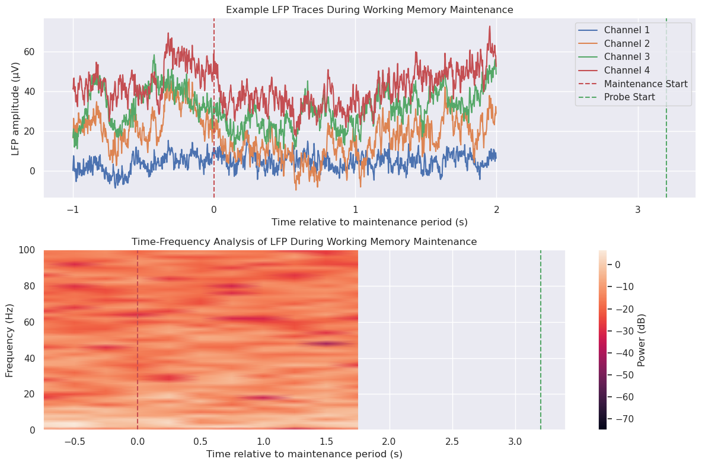  
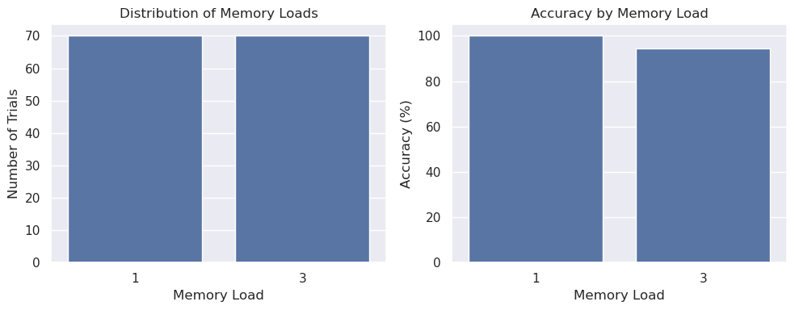  
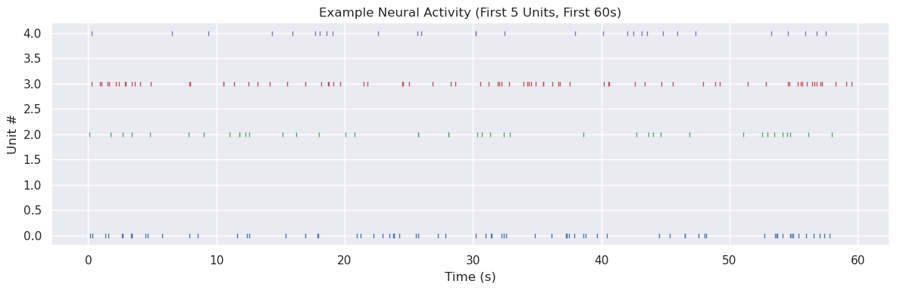  

### 2025-04-09-claude-3.7-sonnet

**Model:** anthropic/claude-3.7-sonnet  
**Generated:** 2025-04-09 23:30:48  
**Generation Time:** 929.34s  
**Prompt Tokens:** 2274.4k  
**Completion Tokens:** 31.2k  
**Estimated Cost:** $7.29  
**Notebook:** [000673.ipynb](https://github.com/dandi-ai-notebooks/000673/blob/main/2025-04-09-claude-3.7-sonnet/000673.ipynb)  

**Generated Images:**

  
  
  
  
  
  
  
  
  
  
  
  
  

### 2025-04-02-claude-3.7-sonnet

**Model:** anthropic/claude-3.7-sonnet  
**Generated:** 2025-04-02 16:34:35  
**Generation Time:** 650.13s  
**Prompt Tokens:** 1053.1k  
**Completion Tokens:** 20.2k  
**Estimated Cost:** $3.46  
**Notebook:** [000673.ipynb](https://github.com/dandi-ai-notebooks/000673/blob/main/2025-04-02-claude-3.7-sonnet/000673.ipynb)  

**Generated Images:**

  
  
  
  
  
  
  
  
  

### 2025-04-04-deepseek-chat-v3-0324

**Model:** deepseek/deepseek-chat-v3-0324  
**Generated:** 2025-04-04 13:20:49  
**Generation Time:** 669.76s  
**Prompt Tokens:** 243.1k  
**Completion Tokens:** 5.1k  
**Estimated Cost:** $0.07  
**Notebook:** [000673.ipynb](https://github.com/dandi-ai-notebooks/000673/blob/main/2025-04-04-deepseek-chat-v3-0324/000673.ipynb)  

**Generated Images:**

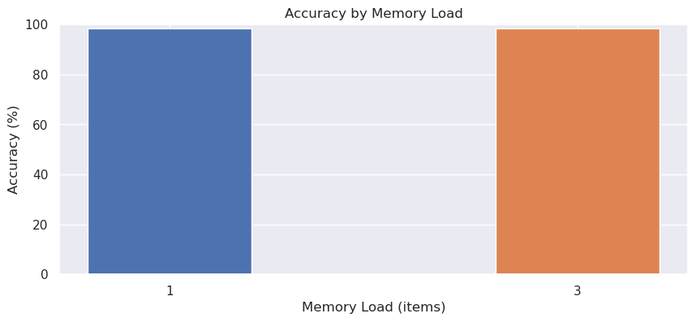  
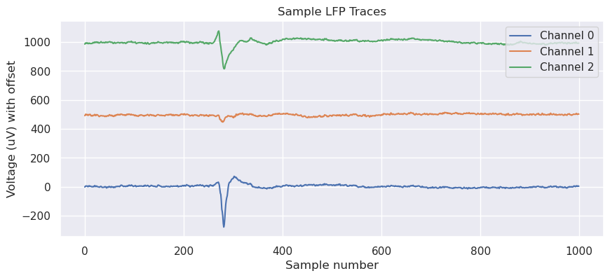  
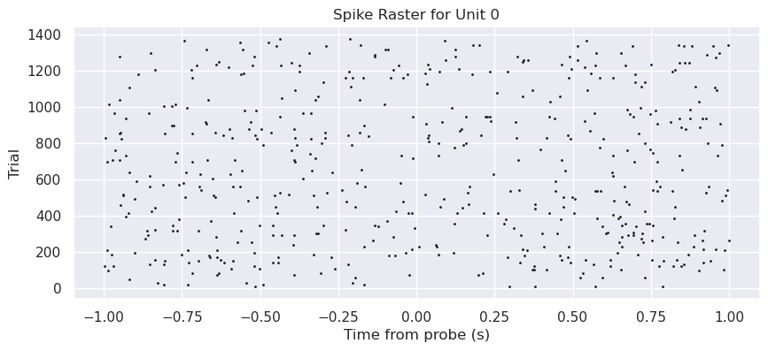  

### 2025-04-04-gemini-2.0-flash-001

**Model:** google/gemini-2.0-flash-001  
**Generated:** 2025-04-04 12:26:01  
**Generation Time:** 57.59s  
**Prompt Tokens:** 208.3k  
**Completion Tokens:** 4.5k  
**Estimated Cost:** $0.02  
**Notebook:** [000673.ipynb](https://github.com/dandi-ai-notebooks/000673/blob/main/2025-04-04-gemini-2.0-flash-001/000673.ipynb)  

**Generated Images:**

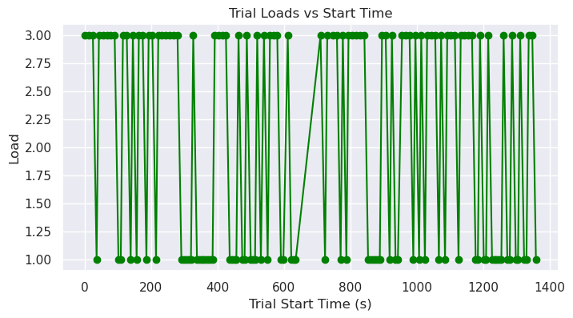  
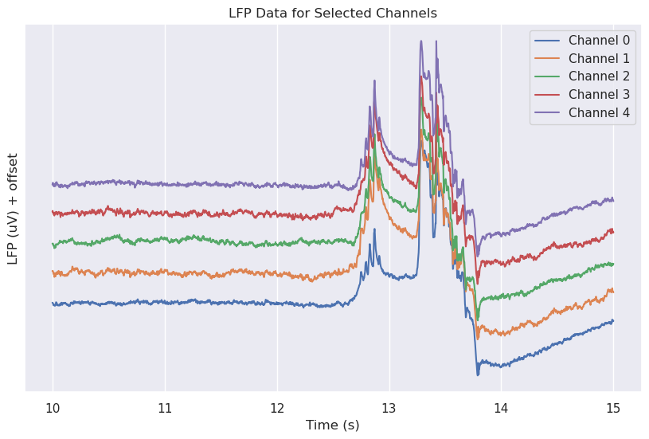  
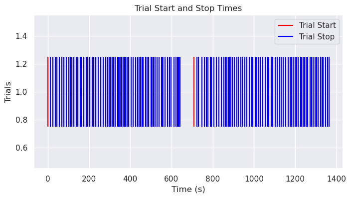  

### 2025-04-07-quasar-alpha-exp

**Model:** openrouter/quasar-alpha  
**Generated:** 2025-04-07 13:06:02  
**Generation Time:** 234.77s  
**Prompt Tokens:** 230.6k  
**Completion Tokens:** 5.5k  
**Estimated Cost:** unknown  
**Notebook:** [000673.ipynb](https://github.com/dandi-ai-notebooks/000673/blob/main/2025-04-07-quasar-alpha-exp/000673.ipynb)  

**Generated Images:**

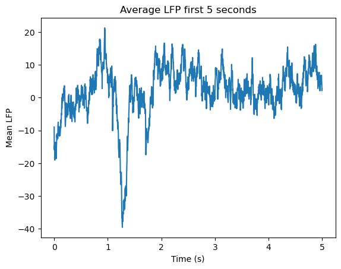  
  
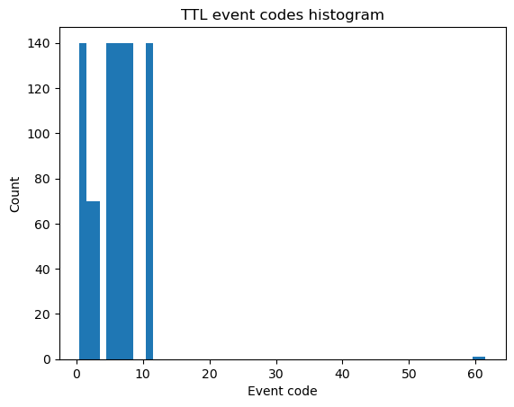  

### 2025-04-09-quasar-alpha

**Model:** openrouter/quasar-alpha  
**Generated:** 2025-04-09 21:09:50  
**Generation Time:** 319.95s  
**Prompt Tokens:** 710.5k  
**Completion Tokens:** 6.3k  
**Estimated Cost:** unknown  
**Notebook:** [000673.ipynb](https://github.com/dandi-ai-notebooks/000673/blob/main/2025-04-09-quasar-alpha/000673.ipynb)  

**Generated Images:**

  
  
  
  

## Dandiset 000945

### 2025-04-07-claude-3.5-sonnet

**Model:** anthropic/claude-3.5-sonnet  
**Generated:** 2025-04-07 14:50:38  
**Generation Time:** 256.28s  
**Prompt Tokens:** 264.4k  
**Completion Tokens:** 6.1k  
**Estimated Cost:** $0.88  
**Notebook:** [000945.ipynb](https://github.com/dandi-ai-notebooks/000945/blob/main/2025-04-07-claude-3.5-sonnet/000945.ipynb)  

**Generated Images:**

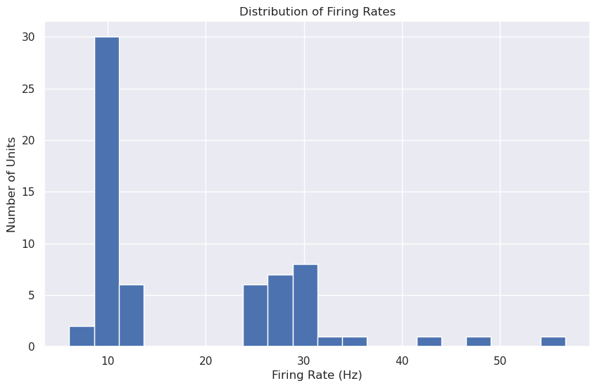  
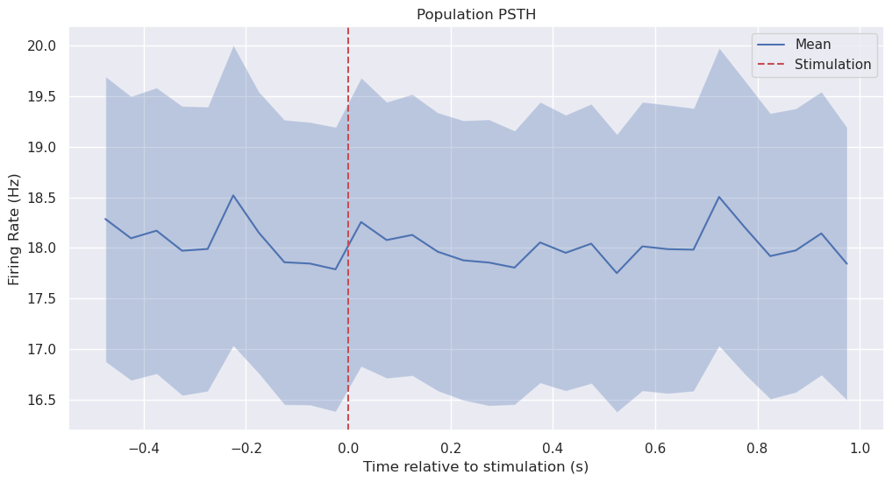  
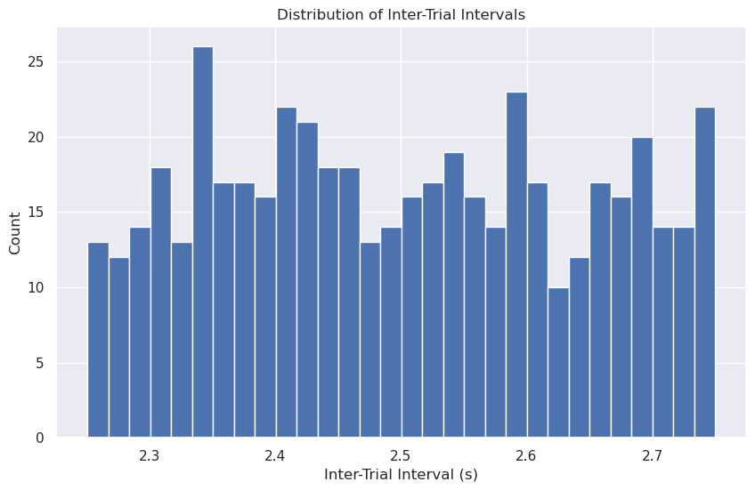  

### 2025-04-02-claude-3.7-sonnet

**Model:** anthropic/claude-3.7-sonnet  
**Generated:** 2025-04-02 17:00:27  
**Generation Time:** 740.43s  
**Prompt Tokens:** 738.7k  
**Completion Tokens:** 23.1k  
**Estimated Cost:** $2.56  
**Notebook:** [000945.ipynb](https://github.com/dandi-ai-notebooks/000945/blob/main/2025-04-02-claude-3.7-sonnet/000945.ipynb)  

**Generated Images:**

  
  
  
  
  
  
  
  
  
  
  

### 2025-04-01-deepseek-chat-v3-0324

**Model:** deepseek/deepseek-chat-v3-0324  
**Generated:** 2025-04-01 09:03:57  
**Generation Time:** 1090.70s  
**Prompt Tokens:** 485.2k  
**Completion Tokens:** 11.4k  
**Estimated Cost:** $0.14  
**Notebook:** [000945.ipynb](https://github.com/dandi-ai-notebooks/000945/blob/main/2025-04-01-deepseek-chat-v3-0324/000945.ipynb)  

**Generated Images:**

  
  
  
  

### 2025-04-04-gemini-2.0-flash-001

**Model:** google/gemini-2.0-flash-001  
**Generated:** 2025-04-04 12:33:24  
**Generation Time:** 64.18s  
**Prompt Tokens:** 279.9k  
**Completion Tokens:** 5.3k  
**Estimated Cost:** $0.03  
**Notebook:** [000945.ipynb](https://github.com/dandi-ai-notebooks/000945/blob/main/2025-04-04-gemini-2.0-flash-001/000945.ipynb)  

**Generated Images:**

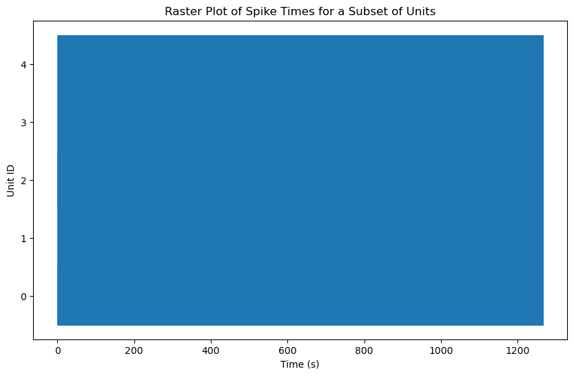  
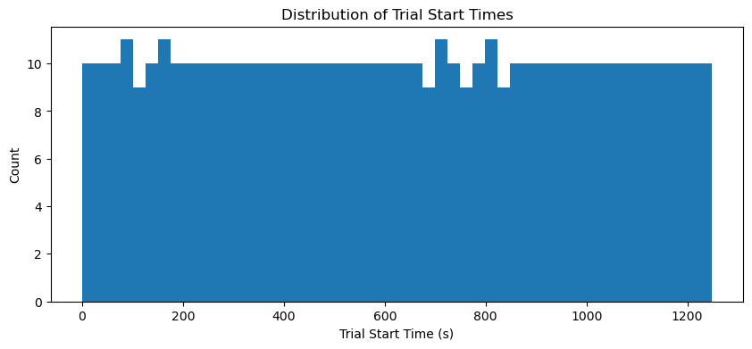  

### 2025-04-07-quasar-alpha-exp

**Model:** openrouter/quasar-alpha  
**Generated:** 2025-04-07 13:13:16  
**Generation Time:** 252.12s  
**Prompt Tokens:** 211.3k  
**Completion Tokens:** 5.5k  
**Estimated Cost:** unknown  
**Notebook:** [000945.ipynb](https://github.com/dandi-ai-notebooks/000945/blob/main/2025-04-07-quasar-alpha-exp/000945.ipynb)  

**Generated Images:**

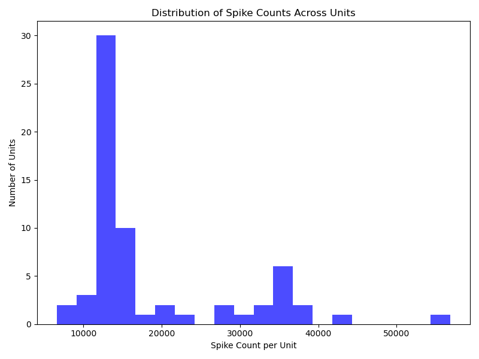  
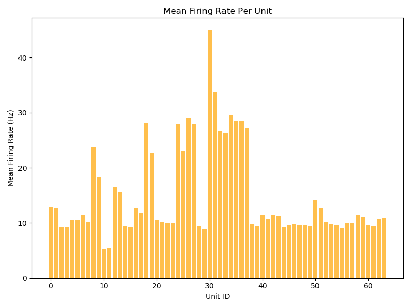  
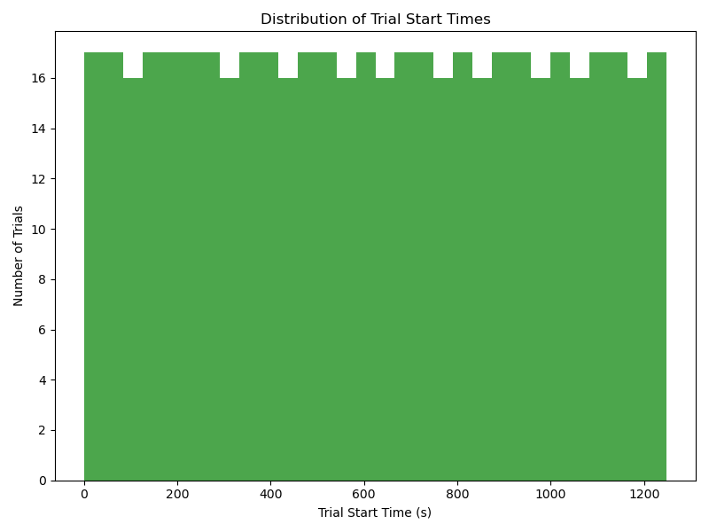  

### 2025-04-09-quasar-alpha

**Model:** openrouter/quasar-alpha  
**Generated:** 2025-04-09 21:13:47  
**Generation Time:** 234.38s  
**Prompt Tokens:** 273.2k  
**Completion Tokens:** 5.5k  
**Estimated Cost:** unknown  
**Notebook:** [000945.ipynb](https://github.com/dandi-ai-notebooks/000945/blob/main/2025-04-09-quasar-alpha/000945.ipynb)  

**Generated Images:**

  
  

## Dandiset 001174

### 2025-04-07-claude-3.5-sonnet

**Model:** anthropic/claude-3.5-sonnet  
**Generated:** 2025-04-07 14:57:48  
**Generation Time:** 196.64s  
**Prompt Tokens:** 235.3k  
**Completion Tokens:** 5.8k  
**Estimated Cost:** $0.79  
**Notebook:** [001174.ipynb](https://github.com/dandi-ai-notebooks/001174/blob/main/2025-04-07-claude-3.5-sonnet/001174.ipynb)  

**Generated Images:**

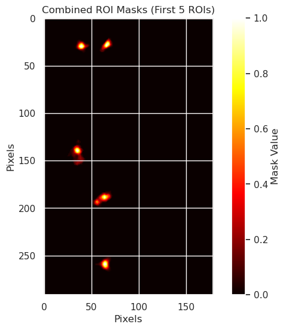  
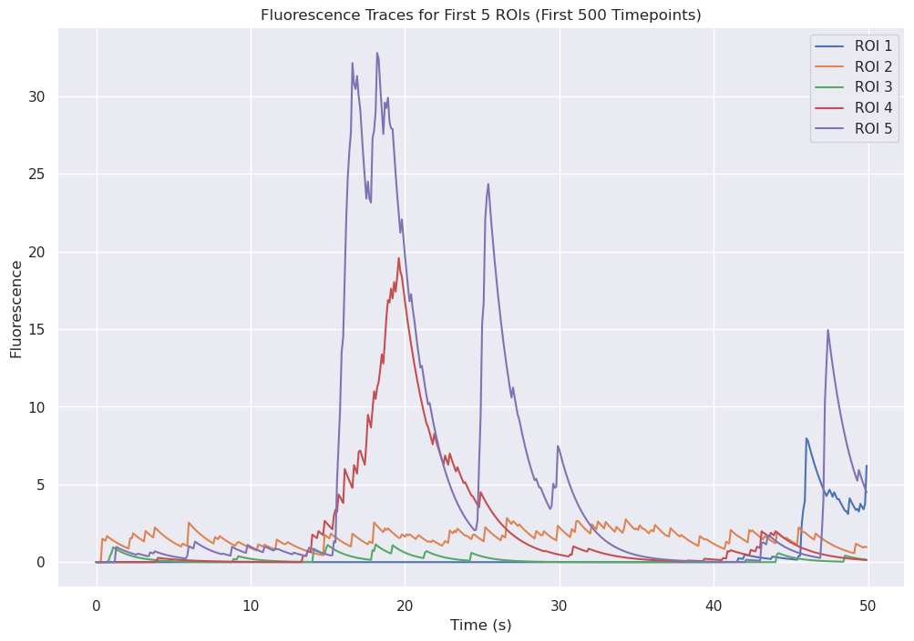  
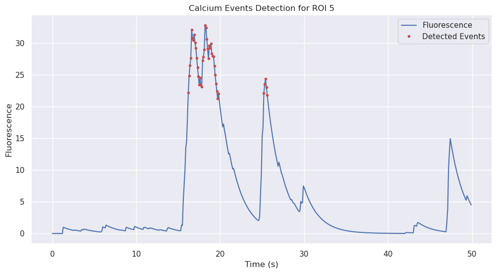  
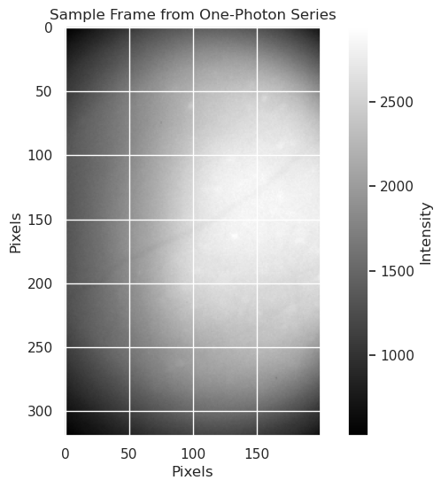  

### 2025-04-03-claude-3.7-sonnet

**Model:** anthropic/claude-3.7-sonnet  
**Generated:** 2025-04-03 14:29:14  
**Generation Time:** 475.38s  
**Prompt Tokens:** 783.5k  
**Completion Tokens:** 16.8k  
**Estimated Cost:** $2.60  
**Notebook:** [001174.ipynb](https://github.com/dandi-ai-notebooks/001174/blob/main/2025-04-03-claude-3.7-sonnet/001174.ipynb)  

**Generated Images:**

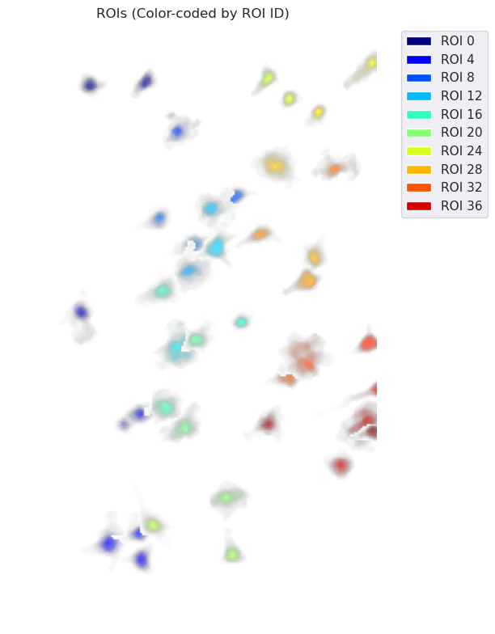  
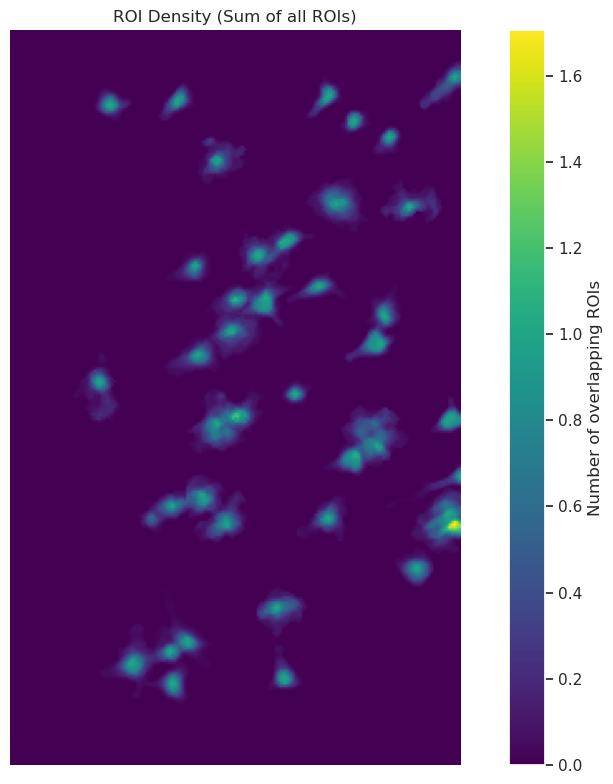  
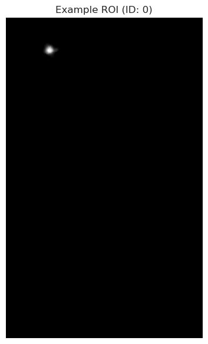  
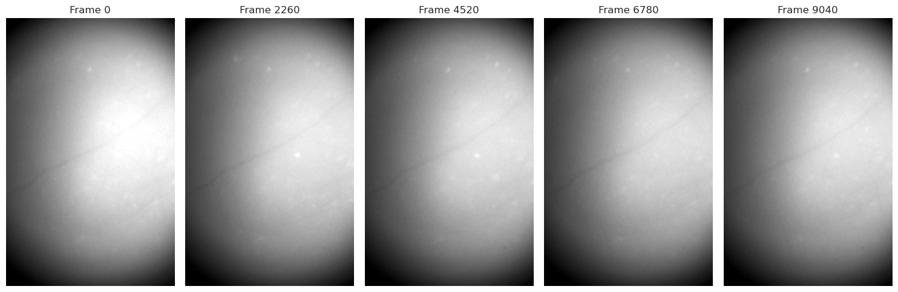  
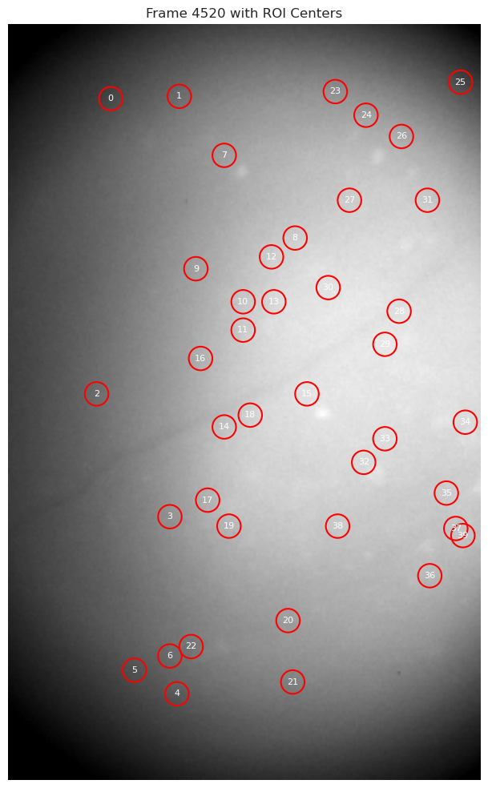  
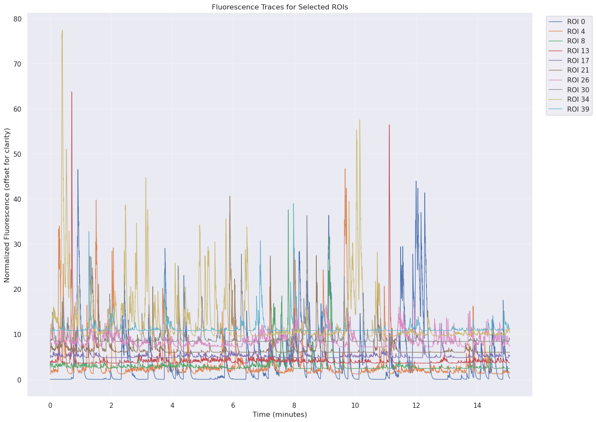  
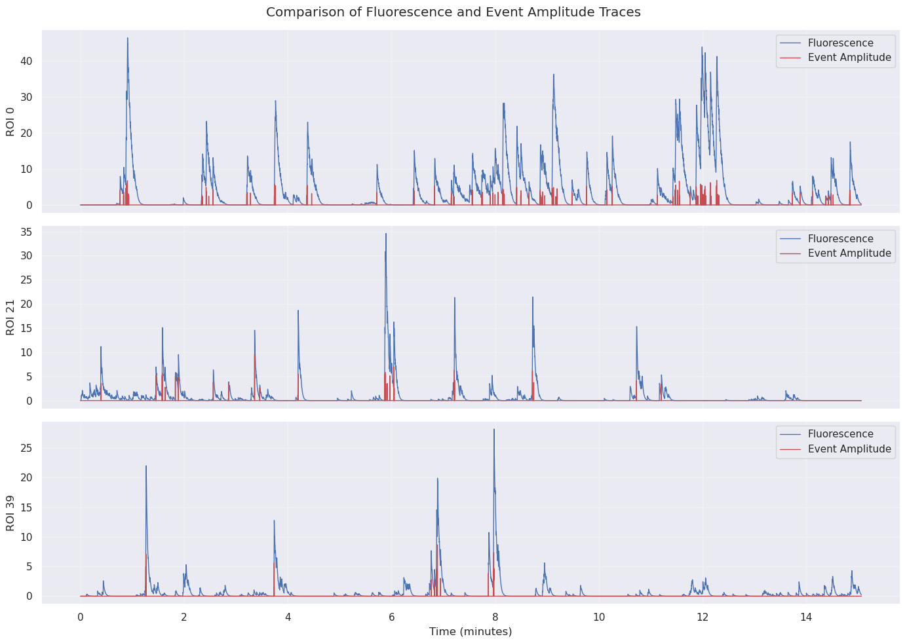  
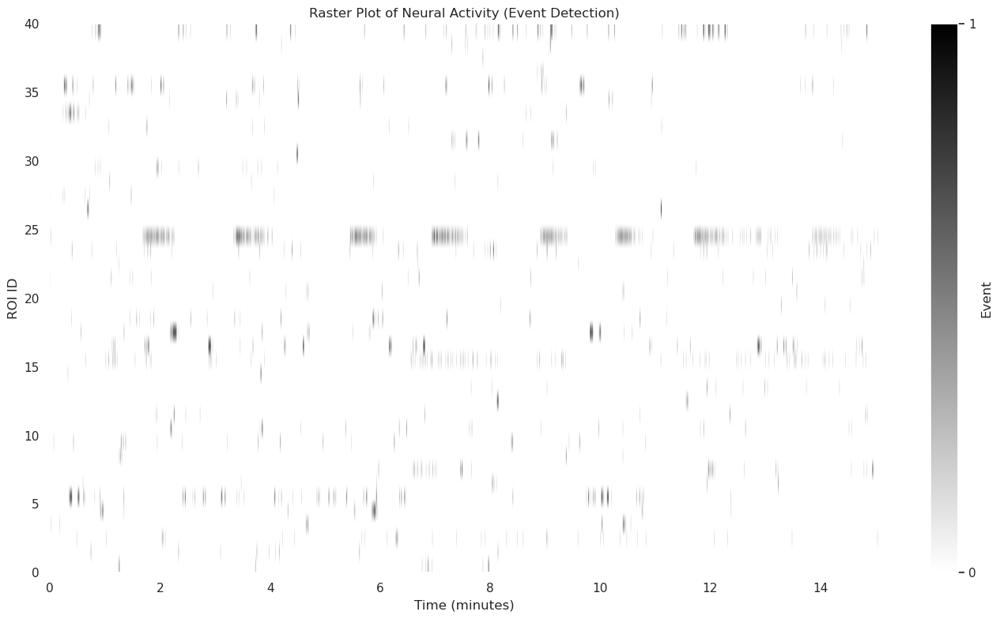  
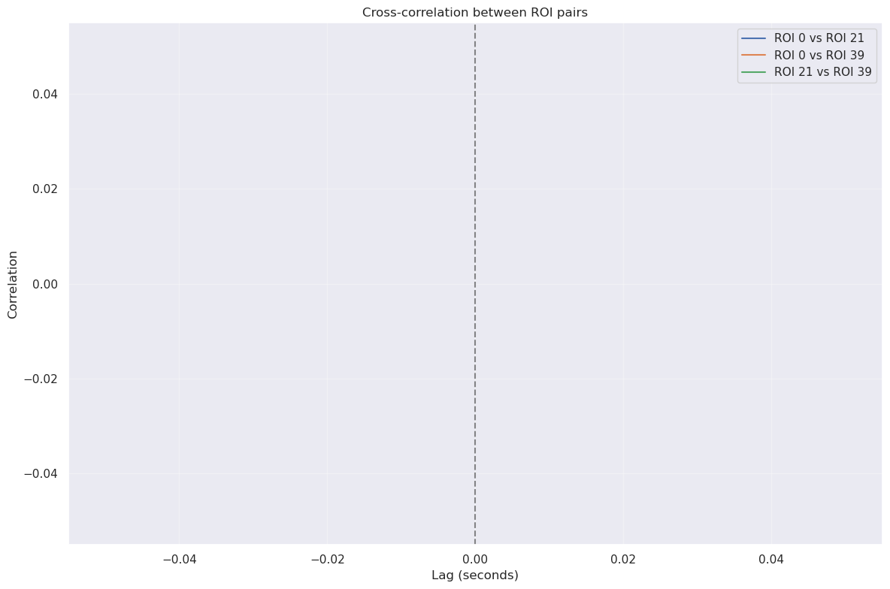  

### 2025-04-01-deepseek-chat-v3-0324

**Model:** deepseek/deepseek-chat-v3-0324  
**Generated:** 2025-04-01 07:50:06  
**Generation Time:** 465.49s  
**Prompt Tokens:** 182.9k  
**Completion Tokens:** 4.0k  
**Estimated Cost:** $0.05  
**Notebook:** [001174.ipynb](https://github.com/dandi-ai-notebooks/001174/blob/main/2025-04-01-deepseek-chat-v3-0324/001174.ipynb)  

**Generated Images:**

  
  
  

### 2025-04-04-gemini-2.0-flash-001

**Model:** google/gemini-2.0-flash-001  
**Generated:** 2025-04-04 12:41:41  
**Generation Time:** 54.46s  
**Prompt Tokens:** 202.9k  
**Completion Tokens:** 4.0k  
**Estimated Cost:** $0.02  
**Notebook:** [001174.ipynb](https://github.com/dandi-ai-notebooks/001174/blob/main/2025-04-04-gemini-2.0-flash-001/001174.ipynb)  

**Generated Images:**

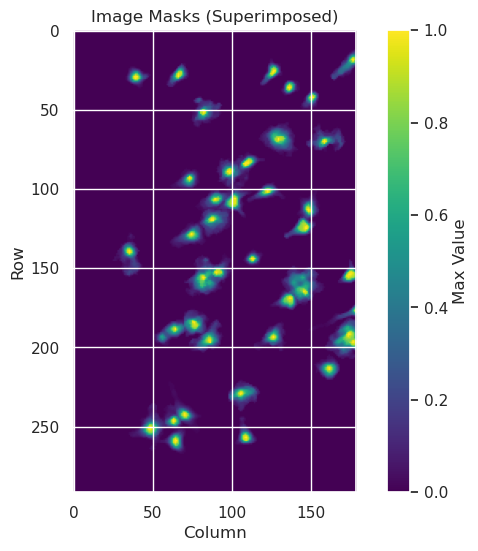  
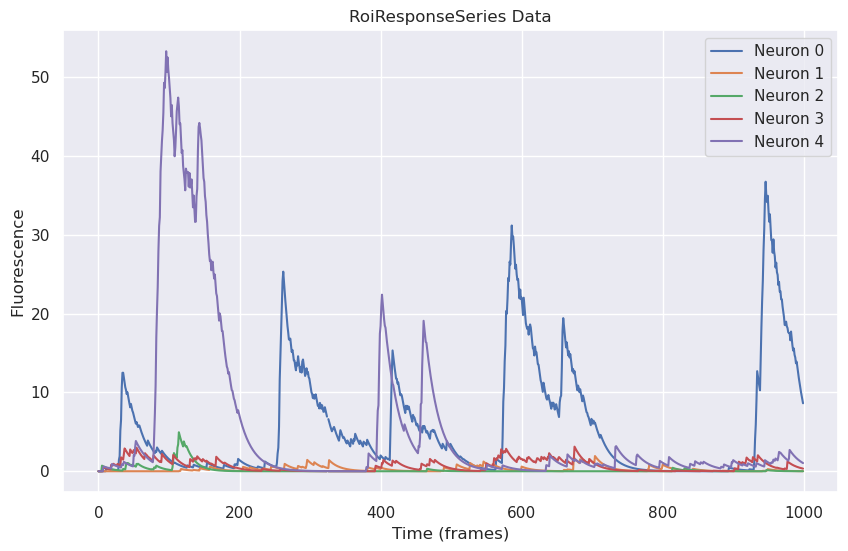  

### 2025-04-07-quasar-alpha-exp

**Model:** openrouter/quasar-alpha  
**Generated:** 2025-04-07 13:20:24  
**Generation Time:** 249.35s  
**Prompt Tokens:** 198.6k  
**Completion Tokens:** 5.1k  
**Estimated Cost:** unknown  
**Notebook:** [001174.ipynb](https://github.com/dandi-ai-notebooks/001174/blob/main/2025-04-07-quasar-alpha-exp/001174.ipynb)  

**Generated Images:**

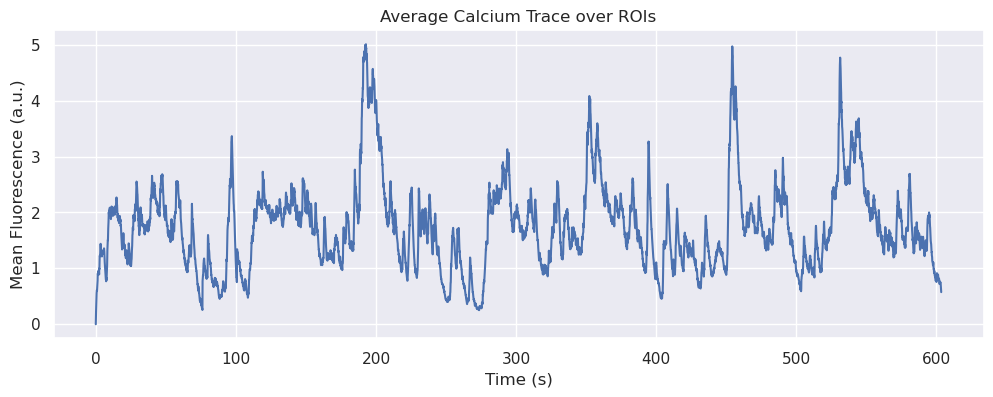  
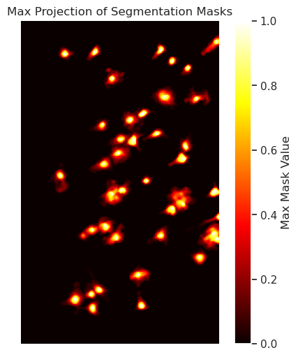  
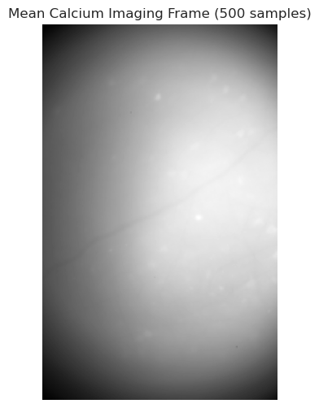  

### 2025-04-09-quasar-alpha

**Model:** openrouter/quasar-alpha  
**Generated:** 2025-04-09 21:16:30  
**Generation Time:** 159.18s  
**Prompt Tokens:** 220.4k  
**Completion Tokens:** 4.5k  
**Estimated Cost:** unknown  
**Notebook:** [001174.ipynb](https://github.com/dandi-ai-notebooks/001174/blob/main/2025-04-09-quasar-alpha/001174.ipynb)  

## Dandiset 001176

### 2025-04-07-claude-3.5-sonnet

**Model:** anthropic/claude-3.5-sonnet  
**Generated:** 2025-04-07 15:12:07  
**Generation Time:** 176.68s  
**Prompt Tokens:** 204.7k  
**Completion Tokens:** 4.5k  
**Estimated Cost:** $0.68  
**Notebook:** [001176.ipynb](https://github.com/dandi-ai-notebooks/001176/blob/main/2025-04-07-claude-3.5-sonnet/001176.ipynb)  

**Generated Images:**

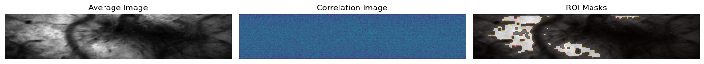  
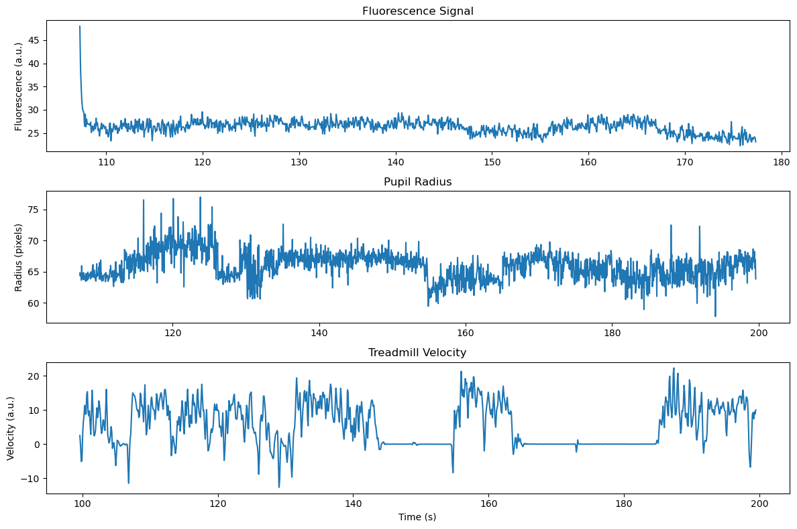  

### 2025-04-02-claude-3.7-sonnet

**Model:** anthropic/claude-3.7-sonnet  
**Generated:** 2025-04-02 17:40:27  
**Generation Time:** 770.31s  
**Prompt Tokens:** 1166.3k  
**Completion Tokens:** 23.6k  
**Estimated Cost:** $3.85  
**Notebook:** [001176.ipynb](https://github.com/dandi-ai-notebooks/001176/blob/main/2025-04-02-claude-3.7-sonnet/001176.ipynb)  

**Generated Images:**

  
  
  
  
  
  
  
  

### 2025-04-04-gemini-2.0-flash-001

**Model:** google/gemini-2.0-flash-001  
**Generated:** 2025-04-04 12:45:14  
**Generation Time:** 75.16s  
**Prompt Tokens:** 267.9k  
**Completion Tokens:** 4.5k  
**Estimated Cost:** $0.03  
**Notebook:** [001176.ipynb](https://github.com/dandi-ai-notebooks/001176/blob/main/2025-04-04-gemini-2.0-flash-001/001176.ipynb)  

**Generated Images:**

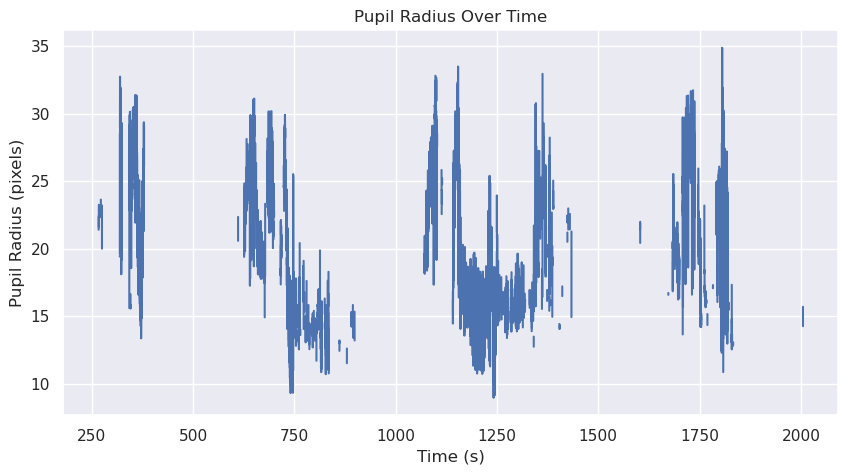  
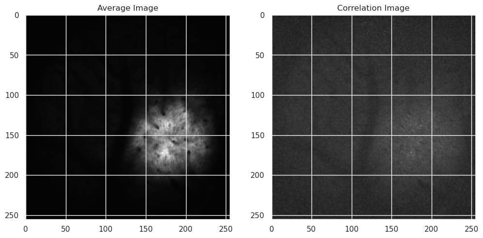  
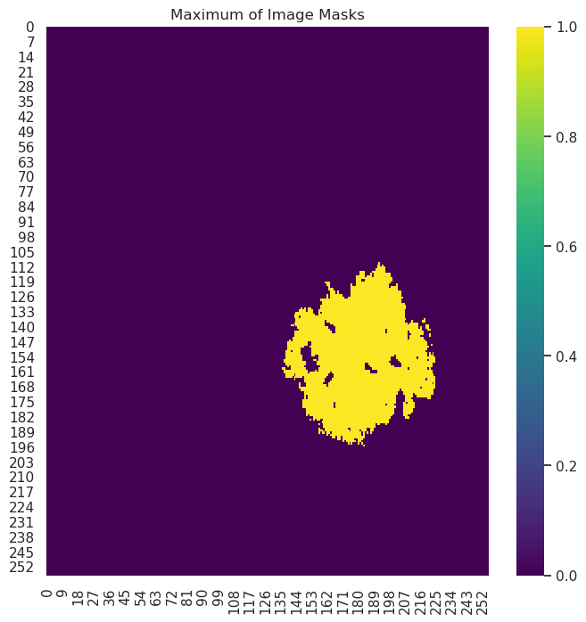  

### 2025-04-07-quasar-alpha-exp

**Model:** openrouter/quasar-alpha  
**Generated:** 2025-04-07 13:30:55  
**Generation Time:** 264.52s  
**Prompt Tokens:** 294.6k  
**Completion Tokens:** 5.7k  
**Estimated Cost:** unknown  
**Notebook:** [001176.ipynb](https://github.com/dandi-ai-notebooks/001176/blob/main/2025-04-07-quasar-alpha-exp/001176.ipynb)  

**Generated Images:**

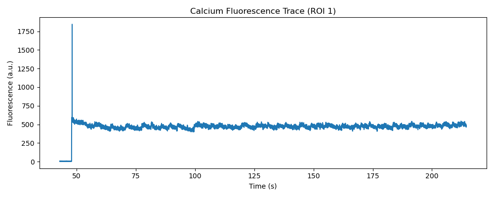  
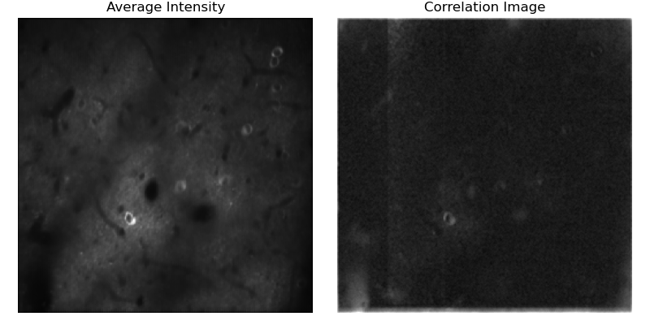  
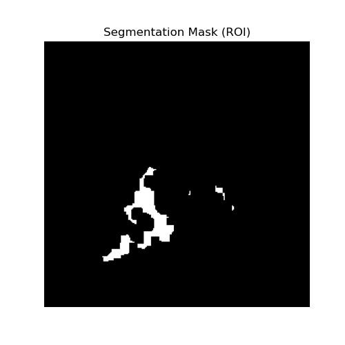  
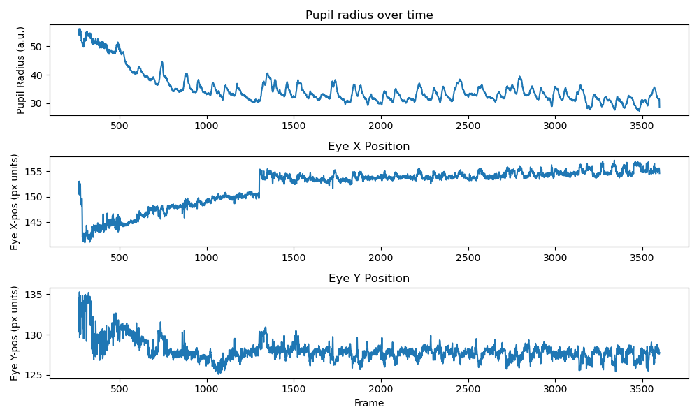  

### 2025-04-09-quasar-alpha

**Model:** openrouter/quasar-alpha  
**Generated:** 2025-04-09 21:23:29  
**Generation Time:** 293.12s  
**Prompt Tokens:** 353.4k  
**Completion Tokens:** 5.9k  
**Estimated Cost:** unknown  
**Notebook:** [001176.ipynb](https://github.com/dandi-ai-notebooks/001176/blob/main/2025-04-09-quasar-alpha/001176.ipynb)  

**Generated Images:**

  
  
  
  

## Dandiset 001275

### 2025-04-07-claude-3.5-sonnet

**Model:** anthropic/claude-3.5-sonnet  
**Generated:** 2025-04-07 15:07:05  
**Generation Time:** 274.05s  
**Prompt Tokens:** 440.7k  
**Completion Tokens:** 6.4k  
**Estimated Cost:** $1.42  
**Notebook:** [001275.ipynb](https://github.com/dandi-ai-notebooks/001275/blob/main/2025-04-07-claude-3.5-sonnet/001275.ipynb)  

**Generated Images:**

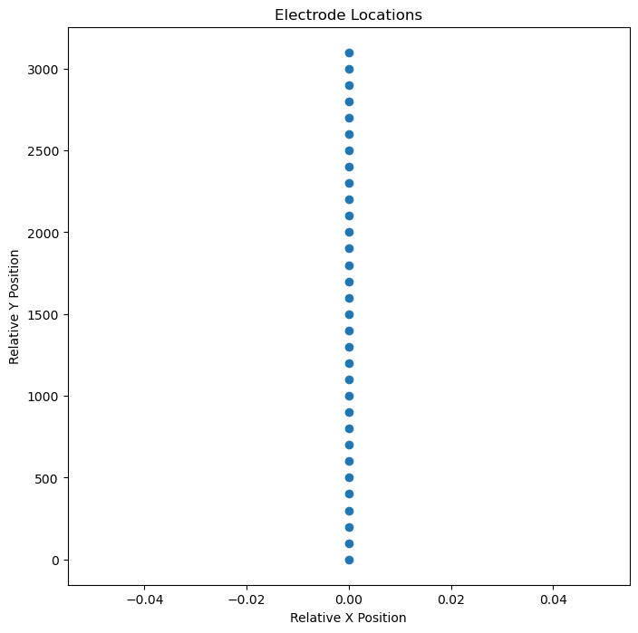  
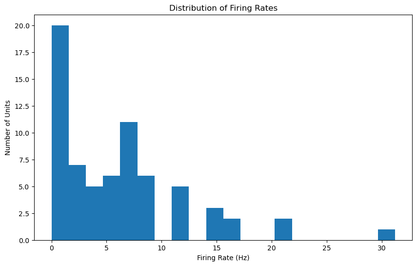  
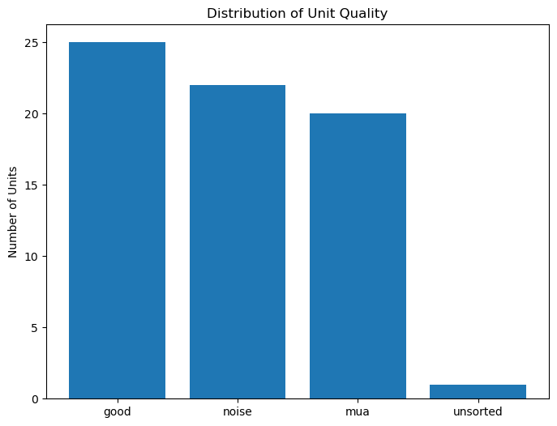  
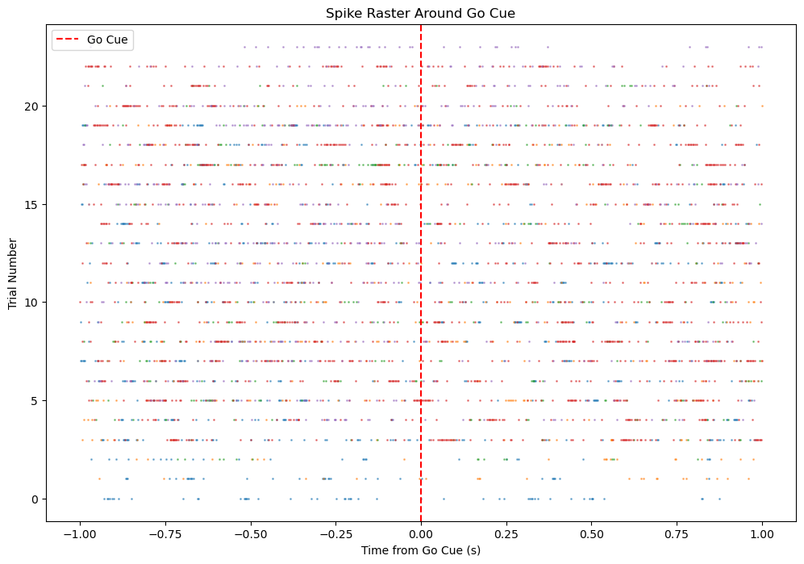  
  
  
  

### 2025-04-02-claude-3.7-sonnet

**Model:** anthropic/claude-3.7-sonnet  
**Generated:** 2025-04-02 19:31:07  
**Generation Time:** 1976.51s  
**Prompt Tokens:** 1003.1k  
**Completion Tokens:** 22.1k  
**Estimated Cost:** $3.34  
**Notebook:** [001275.ipynb](https://github.com/dandi-ai-notebooks/001275/blob/main/2025-04-02-claude-3.7-sonnet/001275.ipynb)  

**Generated Images:**

  
  
  
  
  
  
  
  
  
  
  

### 2025-04-04-deepseek-chat-v3-0324

**Model:** deepseek/deepseek-chat-v3-0324  
**Generated:** 2025-04-04 14:56:59  
**Generation Time:** 420.59s  
**Prompt Tokens:** 189.0k  
**Completion Tokens:** 3.8k  
**Estimated Cost:** $0.06  
**Notebook:** [001275.ipynb](https://github.com/dandi-ai-notebooks/001275/blob/main/2025-04-04-deepseek-chat-v3-0324/001275.ipynb)  

**Generated Images:**

  
  
  

### 2025-04-04-gemini-2.0-flash-001

**Model:** google/gemini-2.0-flash-001  
**Generated:** 2025-04-04 12:43:52  
**Generation Time:** 42.87s  
**Prompt Tokens:** 151.9k  
**Completion Tokens:** 3.7k  
**Estimated Cost:** $0.02  
**Notebook:** [001275.ipynb](https://github.com/dandi-ai-notebooks/001275/blob/main/2025-04-04-gemini-2.0-flash-001/001275.ipynb)  

**Generated Images:**

  

### 2025-04-07-quasar-alpha-exp

**Model:** openrouter/quasar-alpha  
**Generated:** 2025-04-07 13:26:28  
**Generation Time:** 193.64s  
**Prompt Tokens:** 200.0k  
**Completion Tokens:** 5.5k  
**Estimated Cost:** unknown  
**Notebook:** [001275.ipynb](https://github.com/dandi-ai-notebooks/001275/blob/main/2025-04-07-quasar-alpha-exp/001275.ipynb)  

**Generated Images:**

  
  
  
  
  

### 2025-04-09-quasar-alpha

**Model:** openrouter/quasar-alpha  
**Generated:** 2025-04-09 21:18:32  
**Generation Time:** 120.12s  
**Prompt Tokens:** 153.8k  
**Completion Tokens:** 4.1k  
**Estimated Cost:** unknown  
**Notebook:** [001275.ipynb](https://github.com/dandi-ai-notebooks/001275/blob/main/2025-04-09-quasar-alpha/001275.ipynb)  

**Generated Images:**

  
  

## Dandiset 001276

### 2025-04-07-claude-3.5-sonnet

**Model:** anthropic/claude-3.5-sonnet  
**Generated:** 2025-04-07 14:42:12  
**Generation Time:** 367.91s  
**Prompt Tokens:** 355.0k  
**Completion Tokens:** 6.3k  
**Estimated Cost:** $1.16  
**Notebook:** [001276.ipynb](https://github.com/dandi-ai-notebooks/001276/blob/main/2025-04-07-claude-3.5-sonnet/001276.ipynb)  

**Generated Images:**

  

### 2025-04-09-claude-3.7-sonnet

**Model:** anthropic/claude-3.7-sonnet  
**Generated:** 2025-04-09 23:40:40  
**Generation Time:** 588.37s  
**Prompt Tokens:** 1044.2k  
**Completion Tokens:** 22.3k  
**Estimated Cost:** $3.47  
**Notebook:** [001276.ipynb](https://github.com/dandi-ai-notebooks/001276/blob/main/2025-04-09-claude-3.7-sonnet/001276.ipynb)  

**Generated Images:**

  
  
  
  
  
  
  
  
  
  

### 2025-04-02-claude-3.7-sonnet

**Model:** anthropic/claude-3.7-sonnet  
**Generated:** 2025-04-02 20:26:59  
**Generation Time:** 2024.90s  
**Prompt Tokens:** 2625.4k  
**Completion Tokens:** 42.4k  
**Estimated Cost:** $8.51  
**Notebook:** [001276.ipynb](https://github.com/dandi-ai-notebooks/001276/blob/main/2025-04-02-claude-3.7-sonnet/001276.ipynb)  

### 2025-04-04-deepseek-chat-v3-0324

**Model:** deepseek/deepseek-chat-v3-0324  
**Generated:** 2025-04-04 14:14:18  
**Generation Time:** 435.83s  
**Prompt Tokens:** 336.4k  
**Completion Tokens:** 4.9k  
**Estimated Cost:** $0.10  
**Notebook:** [001276.ipynb](https://github.com/dandi-ai-notebooks/001276/blob/main/2025-04-04-deepseek-chat-v3-0324/001276.ipynb)  

**Generated Images:**

  

### 2025-04-04-gemini-2.0-flash-001

**Model:** google/gemini-2.0-flash-001  
**Generated:** 2025-04-04 12:31:32  
**Generation Time:** 138.77s  
**Prompt Tokens:** 229.4k  
**Completion Tokens:** 3.8k  
**Estimated Cost:** $0.02  
**Notebook:** [001276.ipynb](https://github.com/dandi-ai-notebooks/001276/blob/main/2025-04-04-gemini-2.0-flash-001/001276.ipynb)  

**Generated Images:**

  

### 2025-04-07-quasar-alpha-exp

**Model:** openrouter/quasar-alpha  
**Generated:** 2025-04-07 13:09:01  
**Generation Time:** 176.87s  
**Prompt Tokens:** 185.1k  
**Completion Tokens:** 4.5k  
**Estimated Cost:** unknown  
**Notebook:** [001276.ipynb](https://github.com/dandi-ai-notebooks/001276/blob/main/2025-04-07-quasar-alpha-exp/001276.ipynb)  

**Generated Images:**

  

### 2025-04-09-quasar-alpha

**Model:** openrouter/quasar-alpha  
**Generated:** 2025-04-09 21:32:21  
**Generation Time:** 200.46s  
**Prompt Tokens:** 132.2k  
**Completion Tokens:** 3.9k  
**Estimated Cost:** unknown  
**Notebook:** [001276.ipynb](https://github.com/dandi-ai-notebooks/001276/blob/main/2025-04-09-quasar-alpha/001276.ipynb)  

**Generated Images:**

  

## Dandiset 001333

### 2025-04-07-claude-3.5-sonnet

**Model:** anthropic/claude-3.5-sonnet  
**Generated:** 2025-04-07 14:54:28  
**Generation Time:** 226.82s  
**Prompt Tokens:** 296.5k  
**Completion Tokens:** 6.9k  
**Estimated Cost:** $0.99  
**Notebook:** [001333.ipynb](https://github.com/dandi-ai-notebooks/001333/blob/main/2025-04-07-claude-3.5-sonnet/001333.ipynb)  

**Generated Images:**

  
  
  
  
  

### 2025-04-02-claude-3.7-sonnet

**Model:** anthropic/claude-3.7-sonnet  
**Generated:** 2025-04-02 20:43:44  
**Generation Time:** 646.79s  
**Prompt Tokens:** 1043.4k  
**Completion Tokens:** 17.6k  
**Estimated Cost:** $3.39  
**Notebook:** [001333.ipynb](https://github.com/dandi-ai-notebooks/001333/blob/main/2025-04-02-claude-3.7-sonnet/001333.ipynb)  

**Generated Images:**

  
  
  
  
  
  
  

### 2025-04-04-deepseek-chat-v3-0324

**Model:** deepseek/deepseek-chat-v3-0324  
**Generated:** 2025-04-04 14:34:28  
**Generation Time:** 140.00s  
**Prompt Tokens:** 163.5k  
**Completion Tokens:** 2.0k  
**Estimated Cost:** $0.05  
**Notebook:** [001333.ipynb](https://github.com/dandi-ai-notebooks/001333/blob/main/2025-04-04-deepseek-chat-v3-0324/001333.ipynb)  

**Generated Images:**

  

### 2025-04-04-gemini-2.0-flash-001

**Model:** google/gemini-2.0-flash-001  
**Generated:** 2025-04-04 12:36:12  
**Generation Time:** 117.28s  
**Prompt Tokens:** 800.6k  
**Completion Tokens:** 12.7k  
**Estimated Cost:** $0.09  
**Notebook:** [001333.ipynb](https://github.com/dandi-ai-notebooks/001333/blob/main/2025-04-04-gemini-2.0-flash-001/001333.ipynb)  

**Generated Images:**

  

### 2025-04-07-quasar-alpha-exp

**Model:** openrouter/quasar-alpha  
**Generated:** 2025-04-07 13:16:12  
**Generation Time:** 172.43s  
**Prompt Tokens:** 203.2k  
**Completion Tokens:** 4.8k  
**Estimated Cost:** unknown  
**Notebook:** [001333.ipynb](https://github.com/dandi-ai-notebooks/001333/blob/main/2025-04-07-quasar-alpha-exp/001333.ipynb)  

**Generated Images:**

  

### 2025-04-09-quasar-alpha

**Model:** openrouter/quasar-alpha  
**Generated:** 2025-04-09 21:36:07  
**Generation Time:** 101.92s  
**Prompt Tokens:** 125.9k  
**Completion Tokens:** 3.6k  
**Estimated Cost:** unknown  
**Notebook:** [001333.ipynb](https://github.com/dandi-ai-notebooks/001333/blob/main/2025-04-09-quasar-alpha/001333.ipynb)  

**Generated Images:**

  

## Dandiset 001335

### 2025-04-07-claude-3.5-sonnet

**Model:** anthropic/claude-3.5-sonnet  
**Generated:** 2025-04-07 14:46:19  
**Generation Time:** 244.23s  
**Prompt Tokens:** 301.0k  
**Completion Tokens:** 7.1k  
**Estimated Cost:** $1.01  
**Notebook:** [001335.ipynb](https://github.com/dandi-ai-notebooks/001335/blob/main/2025-04-07-claude-3.5-sonnet/001335.ipynb)  

**Generated Images:**

  
  
  
  

### 2025-04-09-claude-3.7-sonnet

**Model:** anthropic/claude-3.7-sonnet  
**Generated:** 2025-04-09 23:51:58  
**Generation Time:** 673.37s  
**Prompt Tokens:** 1164.2k  
**Completion Tokens:** 28.3k  
**Estimated Cost:** $3.92  
**Notebook:** [001335.ipynb](https://github.com/dandi-ai-notebooks/001335/blob/main/2025-04-09-claude-3.7-sonnet/001335.ipynb)  

**Generated Images:**

  
  
  
  
  
  
  
  
  
  
  
  
  
  

### 2025-04-02-claude-3.7-sonnet

**Model:** anthropic/claude-3.7-sonnet  
**Generated:** 2025-04-02 21:13:15  
**Generation Time:** 1119.79s  
**Prompt Tokens:** 1231.4k  
**Completion Tokens:** 34.4k  
**Estimated Cost:** $4.21  
**Notebook:** [001335.ipynb](https://github.com/dandi-ai-notebooks/001335/blob/main/2025-04-02-claude-3.7-sonnet/001335.ipynb)  

**Generated Images:**

  
  
  
  
  
  
  
  
  
  
  
  
  
  
  
  
  

### 2025-04-03-gemini-2.0-flash-001

**Model:** google/gemini-2.0-flash-001  
**Generated:** 2025-04-03 17:29:06  
**Generation Time:** 134.58s  
**Prompt Tokens:** 389.2k  
**Completion Tokens:** 7.2k  
**Estimated Cost:** $0.04  
**Notebook:** [001335.ipynb](https://github.com/dandi-ai-notebooks/001335/blob/main/2025-04-03-gemini-2.0-flash-001/001335.ipynb)  

**Generated Images:**

  
  

### 2025-04-07-quasar-alpha-exp

**Model:** openrouter/quasar-alpha  
**Generated:** 2025-04-07 11:59:17  
**Generation Time:** 242.15s  
**Prompt Tokens:** 329.4k  
**Completion Tokens:** 7.3k  
**Estimated Cost:** unknown  
**Notebook:** [001335.ipynb](https://github.com/dandi-ai-notebooks/001335/blob/main/2025-04-07-quasar-alpha-exp/001335.ipynb)  

**Generated Images:**

  
  
  

### 2025-04-09-quasar-alpha

**Model:** openrouter/quasar-alpha  
**Generated:** 2025-04-09 21:34:22  
**Generation Time:** 118.60s  
**Prompt Tokens:** 171.3k  
**Completion Tokens:** 3.8k  
**Estimated Cost:** unknown  
**Notebook:** [001335.ipynb](https://github.com/dandi-ai-notebooks/001335/blob/main/2025-04-09-quasar-alpha/001335.ipynb)  

**Generated Images:**

  

## Dandiset 001363

### 2025-04-07-claude-3.5-sonnet

**Model:** anthropic/claude-3.5-sonnet  
**Generated:** 2025-04-07 15:02:28  
**Generation Time:** 277.71s  
**Prompt Tokens:** 334.4k  
**Completion Tokens:** 7.7k  
**Estimated Cost:** $1.12  
**Notebook:** [001363.ipynb](https://github.com/dandi-ai-notebooks/001363/blob/main/2025-04-07-claude-3.5-sonnet/001363.ipynb)  

**Generated Images:**

  
  
  

### 2025-04-04-claude-3.7-sonnet

**Model:** anthropic/claude-3.7-sonnet  
**Generated:** 2025-04-04 14:49:55  
**Generation Time:** 923.82s  
**Prompt Tokens:** 1341.8k  
**Completion Tokens:** 22.7k  
**Estimated Cost:** $4.37  
**Notebook:** [001363.ipynb](https://github.com/dandi-ai-notebooks/001363/blob/main/2025-04-04-claude-3.7-sonnet/001363.ipynb)  

**Generated Images:**

  
  
  
  
  
  
  

### 2025-04-01-deepseek-chat-v3-0324

**Model:** deepseek/deepseek-chat-v3-0324  
**Generated:** 2025-04-01 09:07:58  
**Generation Time:** 230.45s  
**Prompt Tokens:** 116.7k  
**Completion Tokens:** 2.9k  
**Estimated Cost:** $0.03  
**Notebook:** [001363.ipynb](https://github.com/dandi-ai-notebooks/001363/blob/main/2025-04-01-deepseek-chat-v3-0324/001363.ipynb)  

**Generated Images:**

  
  

### 2025-04-04-gemini-2.0-flash-001

**Model:** google/gemini-2.0-flash-001  
**Generated:** 2025-04-04 12:42:55  
**Generation Time:** 67.30s  
**Prompt Tokens:** 304.7k  
**Completion Tokens:** 5.2k  
**Estimated Cost:** $0.03  
**Notebook:** [001363.ipynb](https://github.com/dandi-ai-notebooks/001363/blob/main/2025-04-04-gemini-2.0-flash-001/001363.ipynb)  

**Generated Images:**

  
  
  

### 2025-04-07-quasar-alpha-exp

**Model:** openrouter/quasar-alpha  
**Generated:** 2025-04-07 13:23:11  
**Generation Time:** 164.81s  
**Prompt Tokens:** 171.2k  
**Completion Tokens:** 4.8k  
**Estimated Cost:** unknown  
**Notebook:** [001363.ipynb](https://github.com/dandi-ai-notebooks/001363/blob/main/2025-04-07-quasar-alpha-exp/001363.ipynb)  

**Generated Images:**

  

### 2025-04-09-quasar-alpha

**Model:** openrouter/quasar-alpha  
**Generated:** 2025-04-09 21:39:30  
**Generation Time:** 199.40s  
**Prompt Tokens:** 303.2k  
**Completion Tokens:** 6.7k  
**Estimated Cost:** unknown  
**Notebook:** [001363.ipynb](https://github.com/dandi-ai-notebooks/001363/blob/main/2025-04-09-quasar-alpha/001363.ipynb)  

**Generated Images:**

  
  

## Dandiset 001366

### 2025-04-07-claude-3.5-sonnet

**Model:** anthropic/claude-3.5-sonnet  
**Generated:** 2025-04-07 14:32:23  
**Generation Time:** 212.30s  
**Prompt Tokens:** 214.8k  
**Completion Tokens:** 5.5k  
**Estimated Cost:** $0.73  
**Notebook:** [001366.ipynb](https://github.com/dandi-ai-notebooks/001366/blob/main/2025-04-07-claude-3.5-sonnet/001366.ipynb)  

**Generated Images:**

  
  

### 2025-04-09-claude-3.7-sonnet

**Model:** anthropic/claude-3.7-sonnet  
**Generated:** 2025-04-09 23:15:15  
**Generation Time:** 1062.33s  
**Prompt Tokens:** 1710.0k  
**Completion Tokens:** 24.9k  
**Estimated Cost:** $5.50  
**Notebook:** [001366.ipynb](https://github.com/dandi-ai-notebooks/001366/blob/main/2025-04-09-claude-3.7-sonnet/001366.ipynb)  

**Generated Images:**

  
  
  
  
  
  
  
  

### 2025-04-04-claude-3.7-sonnet

**Model:** anthropic/claude-3.7-sonnet  
**Generated:** 2025-04-04 13:09:35  
**Generation Time:** 975.82s  
**Prompt Tokens:** 1596.3k  
**Completion Tokens:** 36.5k  
**Estimated Cost:** $5.34  
**Notebook:** [001366.ipynb](https://github.com/dandi-ai-notebooks/001366/blob/main/2025-04-04-claude-3.7-sonnet/001366.ipynb)  

**Generated Images:**

  
  
  
  
  
  
  
  
  
  
  
  
  

### 2025-04-04-deepseek-chat-v3-0324

**Model:** deepseek/deepseek-chat-v3-0324  
**Generated:** 2025-04-04 12:53:17  
**Generation Time:** 190.71s  
**Prompt Tokens:** 112.8k  
**Completion Tokens:** 2.5k  
**Estimated Cost:** $0.03  
**Notebook:** [001366.ipynb](https://github.com/dandi-ai-notebooks/001366/blob/main/2025-04-04-deepseek-chat-v3-0324/001366.ipynb)  

**Generated Images:**

  

### 2025-04-04-gemini-2.0-flash-001

**Model:** google/gemini-2.0-flash-001  
**Generated:** 2025-04-04 12:22:58  
**Generation Time:** 57.61s  
**Prompt Tokens:** 214.4k  
**Completion Tokens:** 3.9k  
**Estimated Cost:** $0.02  
**Notebook:** [001366.ipynb](https://github.com/dandi-ai-notebooks/001366/blob/main/2025-04-04-gemini-2.0-flash-001/001366.ipynb)  

**Generated Images:**

  

### 2025-04-07-quasar-alpha-exp

**Model:** openrouter/quasar-alpha  
**Generated:** 2025-04-07 13:02:04  
**Generation Time:** 163.30s  
**Prompt Tokens:** 122.6k  
**Completion Tokens:** 4.6k  
**Estimated Cost:** unknown  
**Notebook:** [001366.ipynb](https://github.com/dandi-ai-notebooks/001366/blob/main/2025-04-07-quasar-alpha-exp/001366.ipynb)  

**Generated Images:**

  
  
  

### 2025-04-09-quasar-alpha

**Model:** openrouter/quasar-alpha  
**Generated:** 2025-04-09 21:28:57  
**Generation Time:** 152.98s  
**Prompt Tokens:** 157.3k  
**Completion Tokens:** 5.3k  
**Estimated Cost:** unknown  
**Notebook:** [001366.ipynb](https://github.com/dandi-ai-notebooks/001366/blob/main/2025-04-09-quasar-alpha/001366.ipynb)  

**Generated Images:**

  
  

